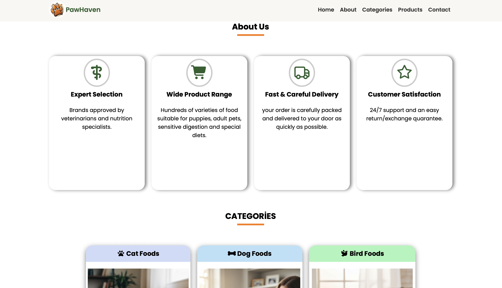
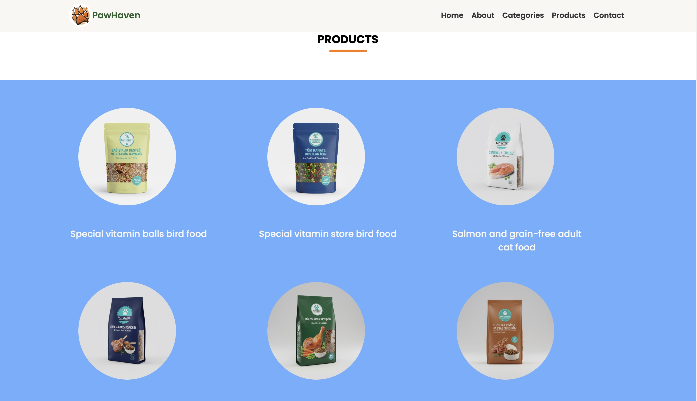

# 🐾 Pet Food Landing Page

This project is a **Landing Page** designed for selling **cat, dog, and bird food products**.  
The website is built to be clean, simple, and user-friendly with a focus on product presentation and easy navigation.

---

## 🛠️ Technologies Used

| Technology     | Description                                            |
| -------------- | ------------------------------------------------------ |
| **HTML**       | Page structure and layout                              |
| **CSS**        | Styling, responsive design, colors, layout adjustments |
| **JavaScript** | Interactive elements and UI behaviors                  |
| **VS Code**    | Code editor used during development                    |

---

## ✨ Features

- 🐶 Supports **cat, dog, and bird** product sections
- 🎨 Modern and responsive UI
- 📌 Clean layout suitable for e-commerce landing pages
- 🔍 Product emphasis through images and text
- 📝 Code includes **comment lines** for clarity and readability
- 📱 Works on desktop and mobile devices

---

## 📂 Project Structure

pet-food-landing-page/
│
├── index.html # Main page
├── style.css # Stylesheet
└── script.js # JavaScript interactions

## images

---

🤝 Contributing

Feel free to suggest improvements, fix issues, or add new UI features through pull requests.

📜 License

This project is for learning and portfolio purposes.
Free to use and modify.
